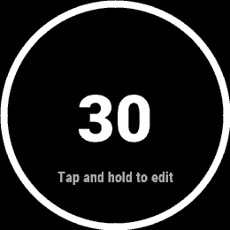
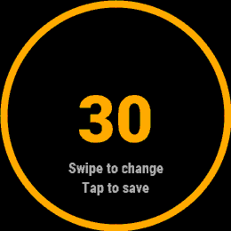
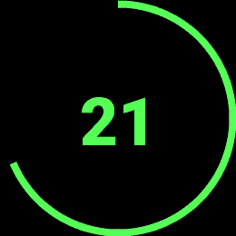

  

<h1 align="center">simple-garmin-rest-timer</h1>

  A tiny Connect IQ rest timer for Garmin watches (vívoactive, Venu, Forerunner, fēnix, epix,
  Instinct, MARQ, Descent, D2, Approach, Enduro — every watch on Connect IQ 3.0+).

  <a href="https://apps.garmin.com/apps/0f10ddf3-a161-44b1-ba24-15360298fdcf"><strong>Get it on the Connect IQ Store</strong></a>

<table align="center">
  <tr>
    <td align="center"></td>
    <td align="center"></td>
    <td align="center"></td>
    <td align="center"></td>
  </tr>
  <tr>
    <td align="center">Ready</td>
    <td align="center">Editing the time</td>
    <td align="center">Counting down</td>
    <td align="center">Time's up</td>
  </tr>
</table>

## Usage

- The screen shows the rest time (default **30**).
- A ring around the edge shows the time left: full while stopped, emptying as it counts down.
  It takes the same color as the number (white when stopped, green while counting down, yellow while editing).
- **Top-right button**: start the countdown. Press again while it's running to reset.
- At **0** the screen shows **TIME** and the watch vibrates with three short pulses, then it resets to the set time.
- **Tap and hold** the screen (while stopped) to edit the time; the number turns yellow.
  - **Swipe up / down** to change it in 5 s steps (5–180).
  - **Tap** the screen or press the **top-right button** to save.
  - **Back** discards the change.
- Watches without a touchscreen: **hold UP** to edit, **UP / DOWN** to change, **START** to save.
- A small hint at the bottom shows "Tap and hold to edit" or "Swipe to change" above "Tap to save" (button hints on non-touch watches).
- The saved time is restored the next time the app opens.

## Development

Requirements: macOS, the [Connect IQ SDK](https://developer.garmin.com/connect-iq/sdk/) (use the SDK Manager
to download an SDK and the devices you want, e.g. `vivoactive4`), and Java 17+.

| Script | What it does |
| --- | --- |
| `scripts/setup.sh` | One-time setup: installs Java with Homebrew if it's missing, creates `developer_key.der`, and checks the SDK and device. |
| `scripts/build.sh [device]` | Builds `bin/RestTimer-<device>.prg`. |
| `scripts/sim.sh [device]` | Builds, starts the simulator if it isn't running, and runs the app in it. |
| `scripts/install.sh [device]` | Builds and copies the app to a USB-connected watch (see below). |
| `scripts/package.sh` | Builds a release `bin/RestTimer.iq` for every watch in the manifest, for the Connect IQ Store. |
| `scripts/clean.sh` | Deletes `bin/`. |

`device` defaults to `vivoactive4`. You can also set these environment variables:

- `DEVICE`: the default device, e.g. `DEVICE=fenix7 scripts/sim.sh`.
- `CIQ_SDK`: the SDK folder, if you don't want the one selected in the SDK Manager.
- `KEY`: the developer key, if it isn't `developer_key.der` in the repo root.

The scripts find `monkeyc` and Java themselves, so neither needs to be on your `PATH`.

### Installing on a watch

Older watches mount as a `GARMIN` drive, and `scripts/install.sh` copies the app straight into `GARMIN/APPS/`.
Newer watches (including the vívoactive 4) use MTP, which macOS doesn't mount. For those, the script
builds the app and shows it in Finder. Copy it into `GARMIN/APPS/` with
[OpenMTP](https://openmtp.ganeshrvel.com), then unplug the watch.

A build signed with your developer key runs on your own watch. You only need the Store to share the app with other people.

## License

[MIT](LICENSE)
